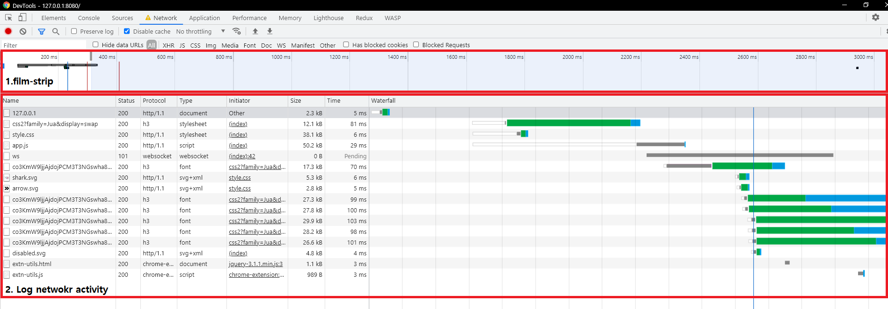
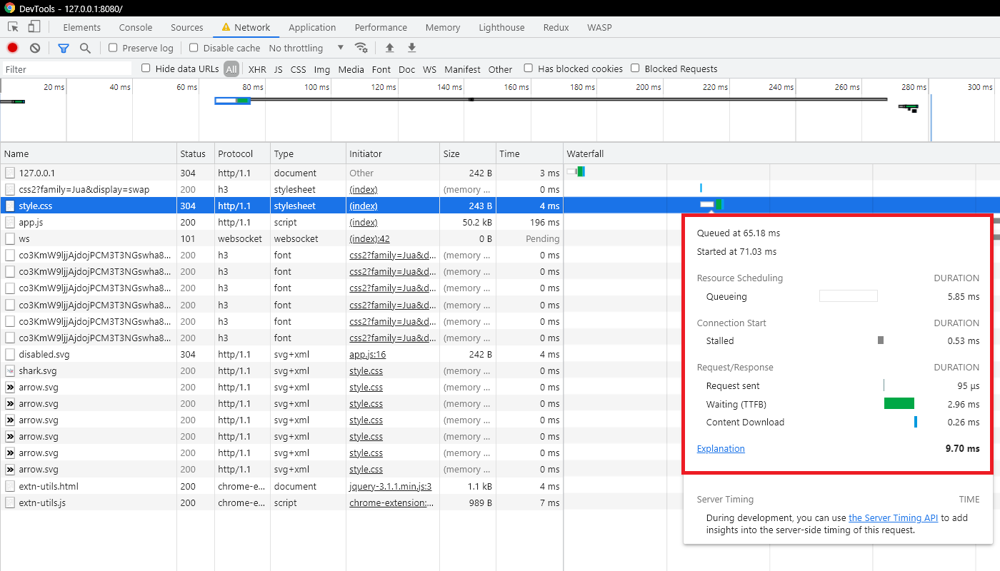
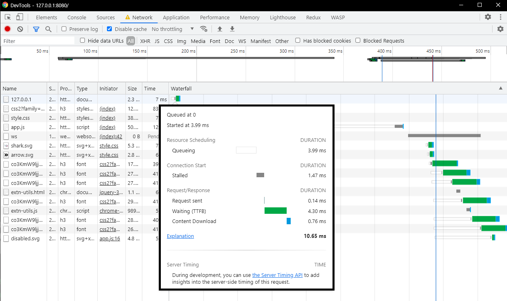
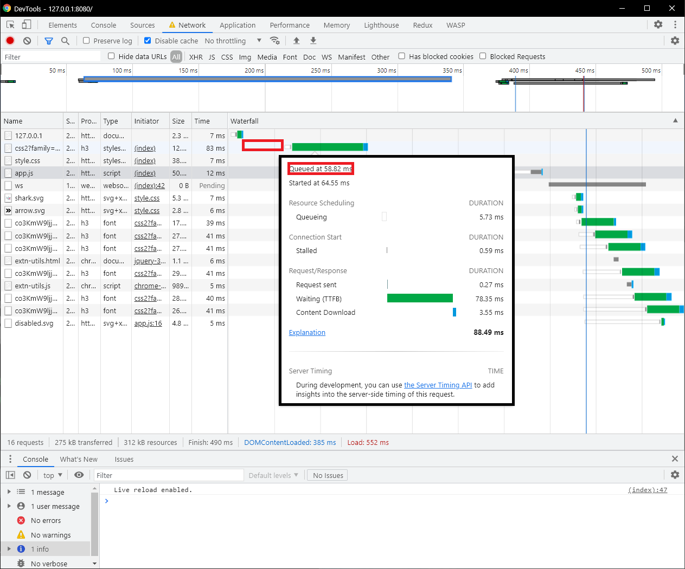
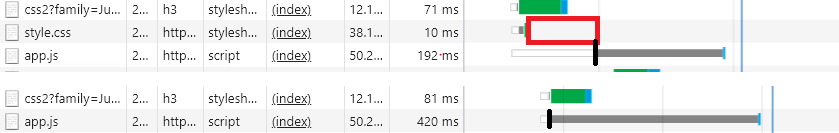

# Network 패널
성능 최적화에 대해 알아보기 전에, Network 패널을 먼저 파헤쳐보자.

## 1.패널 구성

1. **film strip**: 전체 리소스의 요청/응답 순서를 볼 수 있는곳
2. **log network activity**: 브라우저가 서버와 주고받은 네트워크 활동들을 확인할 수 있다. 탭의 각 행은 리소스에 해당하며, 열은 리소스의 세부 정보에 해당한다.
    - Status: HTTP 응답 코드.
    - Type: 리소스 타입
    - Initiator: 해당 행의 리소스를 요청한 리소스.
    - Time: 요청 시작부터 응답까지 걸린 시간.
    - Waterfall: 요청부터 응답까지 과정을 세분화하여 각 단계별 시간을 체크할 수 있는 곳.

### 1.1. Waterfall

waterfall의 그래픽 바에 마우스를 올려보면 상세 정보를 확인할 수 있다.

- Queueing: 브라우저는 다음 세가지 경우에 리소스 요청 항목을 대기열 목록에 입력한다.
    - 더 높은 우선순위의 요청이 있는경우
    - 해당 origin에 이미 6개의 TCP 연결이 되어있는 경우. (HTTP/1.0과 HTTP/1.1에서는 6개 초과의 연결이 불가능 하다.)
    - 브라우저가 디스크 캐시 내의 공간을 확보하고 있는 경우
- Stalled: Queueing에 설명된 세가지 이유 중 하나로 인해 요청이 지연된 시간
- DNS Lookup: 브라우저가 DNS 시스템을 통해 요청 서버의 IP를 받아오는 시간
- Initial connection: SSL 및 TCP의 3 handshake 등 초기 연결 설정을 위해 소모된 시간
- Request sent: 브라우저가 리소스를 요청하는 데 걸린 시간
- Waiting (TTFB-Time To First Byte): 브라우저가 응답의 첫 번째 바이트를 받기까지 걸린 시간. 이 시간에는 요청시작 후 응답까지 소요된 1round latency와, 서버가 응답을 준비하는 데 소요된 시간이 포함된다.
- Content Download: 브라우저가 리소스를 응답을 받기 시작한 후 부터 응답 수신이 완료되기 까지의 시간.

Waterfall을 통해 요청 순서를 확인해 보자.

## 요청 순서 확인하기
1. HTML 문서

요청 대기부터 응답까지 걸린 시간은 10.65 ms 이다.

2. google font 외부 요청

google font를 외부 origin에서 요청하는 작업인데, queued 된 시간이 58.82 ms다. 첫번째 문서의 응답이 10.65 ms에 완료되고 약 48ms가 지난 후에 queued된 이유는 응답받은 바이트코드를 문자열로 변환하고, link 태그를 만나기 까지 파싱하는데 걸린 시간이라고 추측한다.

2번이 queue에 등록되고 그 직후 곧이어, style.css와 app.js가 대기열에 등록된다.
3. style.css
4. app.js
5. 그외...

## blocking 확인

빨간색 박스를 보면 style.css 응답완료 후 일정시간 후에 app.js가 대기열에서 빠져나온다. 하지만 style.css를 요청하지 않은 경우에는, 대기열에서 매우 짧은시간 내에 빠져나온 것을 확인할 수 있다. 

그런데 한가지 이상한 점이있다. style의 사용여부 혹은 defer, async 사용 여부와 상관없이 app.js stalled되어 일정한 시간 후에 리소스를 요청하고 content를 다운로드한다.

##### reference:
- network feature reference #waterfall. (2021.07.11) 
URL: https://developer.chrome.com/docs/devtools/network/reference/#timing-explanation

- Inspect network activity. (2021.07.11)
URL: https://developer.chrome.com/docs/devtools/network/